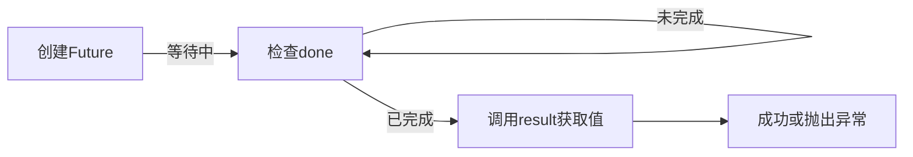

# 服务

话题实现了节点之间的通信，但是发布者一旦启动，它就会按照定时器的周期源源不断地给订阅者传数据，订阅者只能被动地接收所有数据——然而，很多时候我们不是这样的工作方式，有时我们希望：

订阅者在需要数据的时候，才去请求发布者的数据，而发布者接收到请求后，才去返回数据。
发布者相当于**服务器端**，而订阅者相当于**客户端**

- 客户端/服务器（C/S） 模型
- 服务器端唯一，客户端可以不唯一
- .srv文件定义请求和应答数据结构

我们来实现一个加法求和器，客户端发送加数给服务器端，服务器端相加后再返回结果给客户端。

---

## 定义通信接口
通信接口简介（简要步骤与注意事项，针对 C++ 功能包 `learning_interface`）：

- 接口定义文件
    - 话题：放在 `msg/` 下，文件后缀 `.msg`。
    - 服务：放在 `srv/` 下，文件后缀 `.srv`。例如 `srv/AddTwoInts.srv`：
```srv
int64 a
int64 b
---
int64 sum
```
    - 动作：放在 `action/` 下，文件后缀 `.action`。

- 在功能包中添加服务的步骤（要点）
    1. 创建 `.srv` 文件：在 `learning_interface/srv/AddTwoInts.srv` 中按上例编写请求与应答字段。
    2. 更新 `package.xml`：添加接口生成与运行时的依赖，例如（示例）：
```xml
    <build_depend>rosidl_default_generators</build_depend>
    <exec_depend>rosidl_default_runtime</exec_depend>
    <build_depend>rclcpp</build_depend>
    <exec_depend>rclcpp</exec_depend>
```
         - `rosidl_default_generators` 用于在编译时生成语言绑定（包含 C++ 头文件）。
         - `rosidl_default_runtime` 在运行时提供接口支持。
         - `rclcpp` 是 C++ 节点的运行时依赖。
    3. 更新 `CMakeLists.txt`：确保启用接口生成并安装生成产物（关键示例片段）：
```cmake
find_package(rosidl_default_generators REQUIRED)
find_package(rclcpp REQUIRED)

rosidl_generate_interfaces(${PROJECT_NAME}
    "srv/AddTwoInts.srv"
)

ament_package()

# 在定义可执行文件时，使用 ament_target_dependencies 将 rclcpp 等链接到目标
```
         - 说明：必须在 CMake 中调用 `rosidl_generate_interfaces()`（并在合适位置执行 `ament_package()`），否则不会生成 C++ 的头文件和类型，导致包含失败。
    4. 在 C++ 代码中使用生成的类型：
         - 包含头文件：`#include "learning_interface/srv/add_two_ints.hpp"`
         - 引用类型：`using learning_interface::srv::AddTwoInts;`
         - 创建服务/客户端示例：`node->create_service<AddTwoInts>("add_two_ints", callback);` / `node->create_client<AddTwoInts>("add_two_ints");`

- 构建与验证（Windows 相关提示）
    - 构建：在工作区根运行 `colcon build`。
    - 在 Windows 上构建完成后，运行：
```bat
call install\setup.bat
```
        以便在当前终端加载生成的环境。
    - 验证接口已生成：
```bash
ros2 interface show learning_interface/srv/AddTwoInts
```
    - 如果 `ros2 interface show` 能正确显示字段，说明接口生成成功。

- 额外注意事项
    - 在 Python 示例中可用 `from learning_interface.srv import AddTwoInts`；但在 C++ 功能包中需要包含生成的头文件（见上）。
    - 服务名（如 `add_two_ints`）在服务端与客户端必须完全一致。
    - 如果在 CMake 中忘记调用 `rosidl_generate_interfaces()`，将无法生成语言绑定；在 Windows 下尤其常见，务必检查 `CMakeLists.txt`。
    - 常用调试：先 `colcon build`，再查看 `install/include/learning_interface/srv` 是否存在 `add_two_ints.hpp`。

## 服务器端

我们创建`learning_service`功能包，在`learning_service/learning_service`文件夹里创建`service_adder_server.py`
```python
import rclpy
from rclpy.node import Node
from learning_interface.srv import AddTwoInts   # 自定义的服务器接口，相当于话题的消息类型

class adderServer(Node):
    def __init__(self,name):
        super().__init__(name)
        self.srv = self.create_service(AddTwoInts,"add_two_ints",self.adder_callback)

    def adder_callback(self,request,response):
        response.sum = request.a + request.b
        self.get_logger().info("Incoming request\na: %d  b: %d" % (request.a,request.b))
        return response

def main(args = None):
    rclpy.init(args = args)
    node = adderServer("service_adder_server")
    rclpy.spin(node)
    node.destroy_node()
    rclpy.shutdown()
```
`create_service`: 接收服务器接口类型(此处为AddTwoInts),服务名称，回调函数
当服务器接收到请求时，ROS2底层会：
1. 创建请求对象，类型为`AddTwoInts.Request`
2. 创建响应对象，类型为`AddTwoInts.Response`
3. 按位置将这两个对象传递给回调函数

回调函数的参数：self,request,response分别代表：指向自身的指针，客户端发来的请求参数，服务器端返回的结果。request和response是ROS自动生成的类，形参顺序不能变，因为这是回调函数的固定签名。但形参名称可以变，比如简写成req,res.

比如：
`AddTwoInts.srv`里的内容：
```srv
int64 a
int64 b

---

int64 sum
```
ROS2会自动生成两个类：
- `AddTwoInts.Request` - 包含字段 `a` 和 `b`
- `AddTwoInts.Response` - 包含字段 `sum`

### 客户端

新建`service_adder_client.py`:

```python
import sys  # 用于读取命令行参数
import rclpy
from rclpy.node import Node
from learning_interface.srv import AddTwoInts

class adderClient(Node):
    def __init__(self,name):
        super().__init__(name)
        self.client = self.create_client(AddTwoInts,'add_two_ints')
        while not self.client.wait_for_service(timeout_sec = 1.0):
            self.get_logger().info('service not available,waiting again...')
        self.request = AddTwoInts.Request()

    def send_request(self):
        self.request.a = int(sys.argv[1])
        self.request.b = int(sys.argv[2])   # 从终端用命令行传参，argv[0]是文件名，所以索引从1开始
        self.future = self.client.call_async(self.request)  # 异步方发送请求

def main(args=None):
    rclpy.init(args=args)
    node = adderClient("service_adder_client")
    node.send_request()

    while rclpy.ok():
        rclpy.spin_once(node)
        
        if node.future.done():
            try:
                response = node.future.result()
                node.get_logger().info("Result: %d + %d = %d" % 
                                      (node.request.a, node.request.b, response.sum))
            except Exception as e:
                node.get_logger().error("Service call failed: %r" % (e,))
            break  # 收到响应后退出循环
        else:
            node.get_logger().info("Waiting for response...")
            # 可选：添加延迟避免CPU空转
            # rclpy.sleep(0.1)

    node.destroy_node()
    rclpy.shutdown()

```
`create_client`: 创建客户端，需要两个参数：服务类型(AddTwoInts),服务名称（必须与服务器端一致）
`wait_for_service`: 阻塞等待直到服务可用
`AddTwoInts.Request`:new了一个空的请求对象
`call_async`：client的函数，用于发送异步请求，不阻塞，返回一个`Future`对象,`Future`是异步编程的核心概念，代表一个尚未完成的操作的结果：
- call_async()立即返回，不等待服务端响应
- self.future 是一个占位，表示“未来会有的结果”
- 初始状态：未完成(Pending)
- 收到响应后：完成,结果可用



### Response 是怎么获取到的？
流程详解
```python
# 步骤1：发送请求时创建 Future
self.future = self.client.call_async(self.request)
# Future 内部有一个队列，等待服务端响应

# 步骤2：循环中不断处理
rclpy.spin_once(node)  # 这个调用会处理网络消息
# 当服务端响应到达时，spin_once 会将数据填入 future

# 步骤3：检查是否完成
if node.future.done():  # 如果响应已到达
    response = node.future.result()  # 取出响应数据
    # result() 返回的就是 AddTwoInts.Response 对象
    # 包含 response.sum 字段
```
