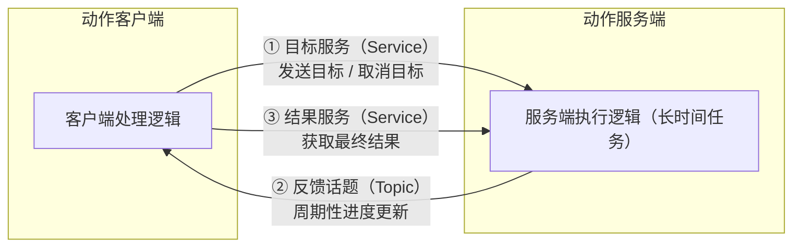
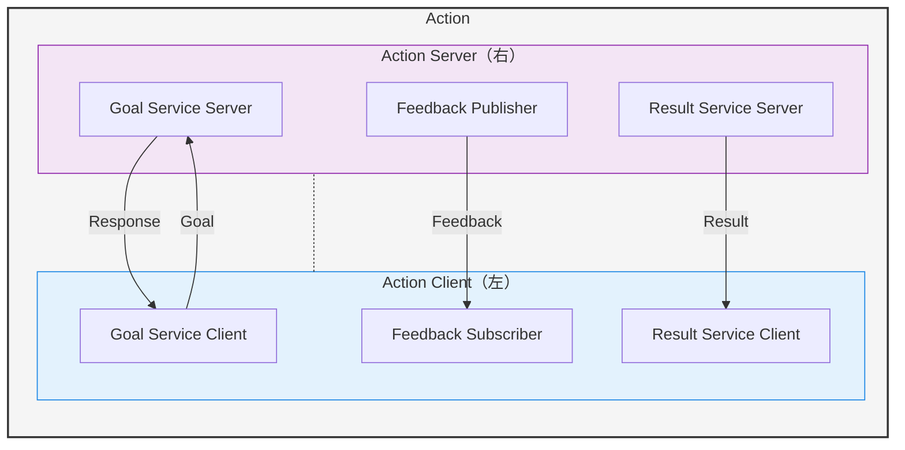

# 动作

机器人控制不仅仅是拿一台设备随意遥控另一台设备这样的任务

我们需要**完整行为的流程管理**，需要两个节点更频繁地互相通信，把握进度。于是ROS2提供了另一种通信机制——动作


- 和服务一样，也是：**客户端/服务器(C/S)模型**，它在“请求-响应”的基础上，增加了执行过程中的连续反馈和任务取消功能
- 服务器端唯一，客户端可以不唯一
- 同步通信机制
- .action文件定义通信接口的数据结构

---

## 动作的C/S模型

1. 客户端发送请求(一个目标)想让机器人动起来，服务器端收到后开始控制机器人运动，

2. 同时返回各种运动参数(比如机器人的位置，姿态，等参数)，

3. 当目标完成，运动结束后，服务器端再反馈一个动作结束的信息。

以上三点，分别使用服务，话题，服务来实现：


序号1其实有两个过程：Goal发送和Response应答，这个在客户端代码里会体现，实际上比较完整的流程长这样：


## 小海龟案例

开启小海龟案例里的两个节点，一个是GUI海龟节点，另一个是键盘节点。这个在第二节课里有：
```bash
ros2 run turtlesim turtlesim_node
```

另一个终端：
```bash
ros2 run turtlesim turtle_teleop_key
```

再新建一个终端：
```bash
# 查看子命令
ros2 action
```
我们可以看到有三个子命令：

- info : 查看动作信息
- list : 查看所有的动作名称
- send_goal: 发送目标

比如
```bash
ros2 action list
```

我们可以看到小海龟示例里有这样一个动作：`/turtle1/rotate_absolute`

如果你只想快速查看某个功能包里所有动作的名称：`ros2 action list | grep <your_package_name>`

现在我们来查看这个小海龟示例动作的信息：
```bash
ros2 action info /turtle1/rotate_absolute
```
再运行一个目标：
先输入这个不完整的命令回车，ROS2会给我们提供可输入的选项：
```bash
ros2 action send_goal /turtle1/rotate_absolute 
```
可以看到：`-f` `--feedback` `turtlesim/action/RotateAbsolute`

`-f`是`--feedback`的缩写，选项的作用是：当动作执行过程中收到反馈时，在终端实时打印出来。这对于调试长时间运行的动作（如导航、机械臂运动）非常有用，可以让你看到进度更新。

`turtlesim/action/RotateAbsolute` —— 该动作的数据类型（Action Type）
这是 `send_goal` 命令的必要组成部分，用于指定你要发送的动作目标遵循哪种数据格式。

- `turtlesim`：功能包名称

- `action`：表明这是一个动作定义文件

- `RotateAbsolute`：动作的具体名称（在海龟仿真器中，表示“绝对角度旋转”）

输入
```bash
ros2 action info /turtle1/rotate_absolute turtlesim/action/RotateAbsolute
```

可以看到建议选项`theta:\ 0.0\`,告诉我们这里的数据应该输入小海龟的旋转角度

完整命令：
```bash
# 注意这里是弧度制，1.57=3.14/2也就是转90°
ros2 action send_goal /turtle1/rotate_absolute turtlesim/action/RotateAbsolute "{theta: 1.57}"
```
可以看出，正式的完整命令格式里，[values]必须是一个合法的`YAML`或`JSON`字典格式

加上反馈，就能在终端里看到反馈信息了：
```bash
ros2 action send_goal /turtle1/rotate_absolute turtlesim/action/RotateAbsolute "{theta: 3.14}" -f
```

## 动作实现

尽管动作是由话题和服务组成的，但我们不需要从头从服务和话题搭建，而是从封装好的接口构建

我们来搭建一个让机器人走一圈的动作：

在之前的`learning_interface` 里定义 `MoveCircle.action`
```action
bool enable # 定义动作的目标，表示动作开始的指令
---
bool finish # 定义动作的结果，表示是否成功执行
--- 
int32 state # 定义动作的反馈，表示当前执行到的位置
```

我们新建`learning_action`功能包
先来看服务器端。在`learning_action/learning_action` 里新建`action_move_server.py`:

```python
import time

import rclpy
from rclpy.node import Node
from rclpy.action import ActionServer
from learning_interface.action import MoveCircle

class MoveCircleActionServer(Node):
    def __init__(self,name):
        super().__init__(name)
        # 创建动作服务器，参数为：接口类型，动作名，回调函数
        self._action_server = ActionServer(
            self,
            MoveCircle,
            'move_circle',
            self.execute_callback)

    def execute_callback(self,goal_handle):
        self.get_logger().info('Moving circle...')
        feedback_msg = MoveCircle.Feedback()    # 创建一个动作反馈信息的消息 

        for i in range(0,360,30):   # 设置每隔30度发送一次反馈，这里显然是模拟，实际上一点真的控制也没有
            feedback_msg.state = i
            self.get_logger().info('Publishing feedback: %d' % feedback_msg.state)
            goal_handle.publish_feedback(feedback_msg)
            time.sleep(0.5)     #模拟运动时间，实际上该教学代码完全没有相关内容

        goal_handle.succeed()   #标记动作成功完成
        
        result = MoveCircle.Result()
        result.finish = True

        return result

def main(args=None):
    rclpy.init(args=args)
    node = MoveCircleActionServer("action_move_server")
    rclpy.spin(node)
    node.destroy_node()
    rclpy.shutdown()

```

`goal_handle`:ROS2在调用回调函数(此处为`execute_callback`)时自动注入，按位置传参，可以改名(比如简写为`gh`)，goal_handle是动作服务器和具体请求之间的"桥梁"，它是一个对象，包含了：

- 请求的上下文信息（谁发的请求、何时发的）
- 控制方法（发送反馈、设置结果、取消动作）
- 状态管理（当前动作是进行中、成功、还是被取消）

```python
def execute_callback(self, goal_handle):
    # goal_handle提供的方法：
    goal_handle.publish_feedback(feedback_msg)  # 发送反馈
    goal_handle.succeed()                       # 标记成功
    goal_handle.abort()                         # 标记失败
    goal_handle.canceled()                      # 标记被取消
```

示例里调用`goal_handle.succeed()`表示动作成功。

`MoveCircle.Goal`,`MoveCircle.Feedback`,`MoveCircle.Result`也是ROS2自动生成的类，示例里
`MoveCircle.Feedback()`是动作接口定义的**反馈消息类型**，用于在执行过程中像客户端发送中间状态信息。
`MoveCircle.Result()`则是**结果消息类型**，用于在动作执行完成后向客户端发送最终结果。


再来看客户端，新建`action_move_client.py`:
```python
import rclpy
from rclpy.node import Node
from rclpy.action import ActionClient

from learning_interface.action import MoveCircle

class MoveCircleClient(Node):
    def __init__(self,name):
        super().__init__(name)
        # 创建客户端的参数为接口类型和动作名
        self._action_client = ActionClient(
            self,
            MoveCircle,
            'move_circle'
        )

    def send_goal(self,enable):
        goal_msg = MoveCircle.Goal()
        goal_msg.enable = enable    # 设置动作目标为使能

        self._action_client.wait_for_server()   #wait_for_server函数，等待服务器端启动
        self._send_goal_future = self._action_client.send_goal_async(   # 异步方式发送动作目标
            goal_msg,
            feedback_callback = self.feedback_callback  # 这个回调函数负责处理周期反馈的消息，也就是那个for循环里不断改变state并传来的feedback_msg
        )

        self._send_goal_future.add_done_callback(self.goal_response_callback)   # 这个函数是服务器收到目标后反馈时的回调函数,你看下面的具体定义就能明白它在哪个阶段起作用

    # 这个意图应该很明显
    def goal_response_callback(self,future):
        goal_handle = future.result()

        if not goal_handle.accepted:
            self.get_logger().info('Goal rejected :(')
            return

        self.get_logger().info('Goal accepted :)')

        self._get_result_future = goal_handle.get_result_async()    # 异步方式获取动作执行最终结果反馈，也就是服务端代码goal_succeed()后面的那些东西
        self._get_result_future.add_done_callback(self.get_result_callback)     
        '''
        这里你就可以看出add_done_callback的含义了，字面含义就是“添加一个(上个函数)做完了就执行的回调函数”,"上个函数做完了"指上个函数调用，且接收到服务器端响应
        它放在send_goal_async后面是发送动作目标后,收到服务器响应就调用。
        而此处放在_get_result_future后面就是发送异步请求后，收到服务器端反馈结果后就调用。
        '''
        
    def get_result_callback(self,future):
        result = future.result()
        result_value = result.result
        self.get_logger().info(f'Result:{result.finish}')

    def feedback_callback(self,feedback_msg):
        feedback = feedback_msg.feedback
        self.get_logger().info(f'Received feedback:{feedback.state}')

def main(args=None):
    rclpy.init(args=args)
    node = MoveCircleClient("action_move_client")
    node.send_goal(True)
    rclpy.spin(node)
    node.destroy_node()
    rclpy.shutdown()

```

显然但凡形参有`future`那也是ROS2自动注入的，形参里的 `future` 是存放客户端异步请求后接收到的服务器端反馈的容器，通过 `future.result()` 可以获取实际的反馈数据
比如`get_result_callback`里的`future`:当`_get_result_future`完成后，接受服务器端反馈信息

`feedback_msg`也是ROS2设计好的，通过它能直接拿到服务器端不断反馈过来的消息。feedback_msg 是 ROS 2 底层在服务器发布反馈时主动作为参数传递给回调函数的，它不是像 future 那样的“占位形参自动注入”，而是事件驱动的参数传入。这个暂时不理解也不要紧，先记住用法。

一般来说`future`是`add_done_callback`函数用的，`feedback_msg`是一开始异步请求用的，它们都是ROS2自动注入的，与`goal_handle`同理