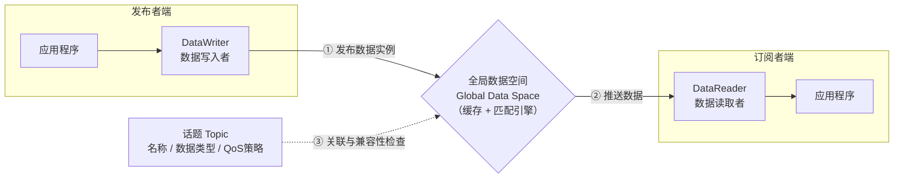

# DDS

之前讲述的话题，服务，这些ROS2的通信机制，必须依靠一个协议，这个协议就是DDS(数据分发服务)

它是分布式实时系统中数据发布/订阅的标准解决方案

---

## DDS模型

不同于TCP的点对点，也不同于以一个Broker为中心的MQTT，DDS更接近于广播模式,但广播模式下所有节点都可以发布消息，有许多消息与自己无关。

DDS采用以**数据为中心的模式**:
- 所有节点都可以在DataBus上发布和订阅消息。
- 通路里包含很多并行的通路，每个节点可以只关心自己需要的。

ROS2 为了**提高代码的复用性**，为开发者设计了中间层——不同厂商不同标准的DDS模型要想使用ROS2，就必须遵守ROS2的规范，使得开发者不必修改代码。




## QoS策略

QoS(Quality of Service，服务质量)

DDS是ROS2的通信系统，QoS则规定了这套系统的“交通规则”，通过QoS，让你能根据不同数据的特性，为每个话题（Topic）“量身定制”通信策略。

比如：
- 发送控制指令(刹车，停止等),要求**高可靠**，**低延迟**
- 发送摄像头画面，允许少量丢帧，但要求**高带宽**和**实时性**
这两种情形，显然需要不同的通信策略，而ROS1中通信策略就是TCP，把选择锁死了

ROS2的QoS则提供了多种选择，下面是六大核心策略：

### History（历史记录）& Depth（深度）

这两个策略共同决定了消息缓存的方式。
| 策略 | 含义 | 适用场景 |
| --- | --- | --- |
| Keep Last + Depth=N | 只保留最新的 N 条消息 | 绝大多数场景——只关心最新状态 |
| Keep All | 保留所有消息（受资源限制） | 离线分析、需要处理全部历史数据 |

    类比：Keep Last 像滚动刷新的聊天窗口（只显示最近几条），Keep All 像完整存档的聊天记录。

### Reliability（可靠性）

这是最常用的策略，决定了消息是否能保证送达。
| 策略 | 含义 | 适用场景 |
| --- | --- | --- |
| RELIABLE（可靠） | 保证送达，可能重试多次 | 控制指令、关键状态、服务调用 |
| BEST_EFFORT（尽力而为） | 尽力发送，但可能丢包 | 高频传感器数据（摄像头、雷达） |

    类比：RELIABLE 像挂号信（签收确认），BEST_EFFORT 像平信（寄出不管）。

    ⚠️ 注意：即使是 RELIABLE 模式，底层依然使用 UDP 实现，并非 TCP。

### Durability（持久性）

决定新加入的订阅者能否收到历史数据。
| 策略 | 含义 | 适用场景 |
| --- | --- | --- |
| TRANSIENT_LOCAL（本地暂存） | 发布者缓存最新数据，晚加入的节点也能收到 | 静态地图、机器人状态、参数 |
| VOLATILE（易失） | 不缓存数据，晚加入的节点收不到历史消息 | 实时传感器数据 |

    类比：TRANSIENT_LOCAL 像公告栏（后来的人也能看到之前贴的通知），VOLATILE 像广播（错过就没了）。

### Deadline（截止时间）

要求两次消息发布之间的间隔不超过指定的时长。如果超时未收到消息，系统会触发事件通知。

    适用场景：看门狗（Watchdog）机制——如果超过 100ms 没收到激光雷达数据，就认为传感器出了问题。

### Lifespan（生命周期）

设置消息的有效期。超过这个时间未被接收的消息会被视为“过期”并自动丢弃。

    适用场景：传感器数据——过时的数据比没有数据更糟糕。

### Liveliness（存活状态）

用于检测发布者是否“活着”。
| 策略 | 含义 |
| --- | --- |
| AUTOMATIC | 系统自动检测——只要发布过消息就算活着 |
| MANUAL_BY_TOPIC | 需要手动调用 API 声明"我还活着" |

## QoS使用

可以通过输入不完整命令`ros2 topic echo /chatter --qos-`然后Tab查看提示

**发布者和订阅者的QoS策略必须一致**

我们可以直接打开之前学习话题时的代码，创建发布者/订阅者的函数里有一个数字参数表示队列长度

```python
self.pub = self.create_publisher(String,"chatter",10)   #第三个参数为队列长度
```
实际上，这个地方可以传入一个`QoSProfile`对象：
开头加入
```python
from rclpy.qos import QoSProfile,QoSReliabilityPolicy,QoSHistoryPolicy
```
导入ROS2 QoS类


然后在构造函数里，`self.pub`定义之前定义发布者的QoS原则,再把`10`改成这个实例：
```python
qos_profile = QosProfile(
    reliability = QoSReliabilityPolicy.RELIABLE,
    history = QoSHistoryPolicy.KEEP_LAST,
    depth = 1
)

self.pub = self.create_publisher(String,"chatter",qos_profile)
```

订阅者的修改方式一样，注意二者QoS策略必须一致