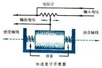
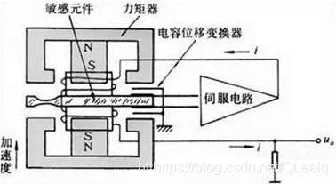

# IMU

IMU(Inertial measurement unit)，惯性测量单元

是一种**机电传感器**，能反馈自身的运动状态和位姿。广泛用于无人机和机器人的导航和控制，甚至可以说IMU的好坏决定了产品的性能。

## 核心概述

IMU是一种基于**惯性原理**，通过集成**加速度计**和角加速度计(也就是我们常说的**陀螺仪**)，实时测量载体再三维空间内的线加速度、角速度，并进一步解算出**姿态角**(俯仰角、横滚角、偏航角)的传感器组合装置

由于完全依靠物理仪器和惯性原理进行测量和数学求解，不需要GPS、雷达等外部支持，因此在有干扰的环境下也能正常工作。正是因为陀螺仪和加速度计一般都依靠经典力学里的惯性(牛二)求解，故叫做“惯性测量单元”

- **6轴IMU：**由三个单轴的加速度计和三个单轴的陀螺仪组成，加速度计检测物体在载体坐标系统独立三轴的加速度信号，而陀螺仪检测载体相对于导航坐标系的角速度信号，这样就测量出来六个自由度的运动信息
- **9轴IMU：** 除了6轴IMU的六个自由度上的信息以外，在加速度计和陀螺仪的基础上加入磁力计，就形成了"9轴IMU"。

## 工作原理

1. 首先知晓自身的初始位置，即三维世界坐标系下的位置$(X_s,Y_s,Z_s)$,和初始姿态也就是自身坐标系下的yaw,pitch,roll$(\alpha,beta,\gamma)$
1. 连续测量自己在世界坐标系下的加速度$(\alpha_x,\alpha_y,\alpha_z)$,对时间二次积分得到航迹和当前位置$(X_c,Y_c,Z_c)$ 
1. 连续测量自身坐标系下姿态角的变化，或连续测量角速度并对时间积分，得到当前的姿态。

## 加速度计

常规的加速度计就是用初中学的牛顿第二定律设计的：

加速度计的检测装置检测的是引起加速度的惯性力，随后可利用牛顿第二定律获得加速度值。测量原理可以用一个简单的质量块、弹簧和指示计来表示

当载具运动并产生加速度时，为了保证$F=ma$,弹簧会发生伸长和缩短，这样指针的位置就发生改变，可变电阻的阻值也随之改变——这样就把加速度信号转化为电信号，至于具体的转化关系只是一道中学物理的题目罢了。

还有其它形式的加速度计，但它们的原理都一样：加速度导致压力的变化 -> 力导致某个电路元件的变化 。由此完成加速度变化转化为电信号：

- 压电式：压力变化导致电压变化

- 压阻式：压力变化导致半导体的电阻发生变化

- 电容式：压力导致电容变化(高中学过公式C= εS/4πkd嘛，电容和两块极板间的距离有关)

- 伺服式：与一般加速度计相同，但质量m上还接着一个电磁线圈，当基座上有加速度输入时，质量块偏离平衡位置，该位移大小由位移传感器检测出来，经伺服放大器放大后转换为电流输出，该电流流过电磁线圈，在永久磁铁的磁场中产生电磁恢复力，试图使质量块保持在仪表壳体中原来的平衡位置上，所以伺服加速度传感器在闭环状态下工作。由于有反馈作用，增强了抗干扰的能力，提高测量精度，扩大了测量范围

  **简单来说就是用电磁线圈，加了一个负反馈的力，提升了抗干扰能力，扩大测量范围**

  电路图很像初中学电磁线圈设计各种自动化电路的大题：

  

## 陀螺仪

从中学就反复强调：运动分析时要选择参考系

当选择的参考系不是惯性参考系而是**旋转参考系**时，就会产生`科氏加速度`和`科氏力`(理论力学里有讲)

科氏力的公式为：
$$
F_科=-2m \cdot (\omega \times v)
$$

- m 是质量块质量（固定）

- vv 是质量块在X轴上的驱动振动速度（已知，且被精确控制为恒定幅度）

- ω 就是我们要测量的**输入角速度**

两块物体处于不断的运动中，令它们运动的相位相差-180度，即两个质量块运动速度方向相反，而大小相同->它们产生的科氏力相反->压迫两块对应的电容板移动，产生电容差分变化。电容的变化正比于旋转角速度。由电容即可得到旋转角度变化。

这样又实现了角加速度信号转化为电信号

以上是MEMS陀螺仪的原理，它最棘手但最便宜

其实还有很多测量方法：机械陀螺用的是角动量守恒，光纤陀螺用的是光的干涉，这里不一一赘述了。

IMU测量精度主要取决于陀螺仪的好坏——由陀螺仪传感器的类型进行分类

- 挠性陀螺
- 静电陀螺
- 激光陀螺
- 光纤陀螺
- 微机械陀螺（MEMS陀螺）

## 磁力计

- 利用地磁场来定北极的一种器件。

- 能提供装置在XYZ各轴所承受磁场的数据，接着相关数据会汇入微控制器的运算器，以提供磁北极相关的航向角，利用这些信息可侦测地理方位。

- 采用三个互相垂直的磁阻传感器，每个轴向上的传感器检测在该方向上的地磁场强度。

## IMU误差模型

### 一般的误差
有些系统误差是比较容易想到的：

- 安装误差：比如三个轴不可能完美正交

- 刻度误差

还有环境(比如温度)导致的误差：

通过影响$C= εS/4πkd$ 里的ε(介电常数)影响电容，进而造成误差

陀螺仪静置时，温度变化会让它“以为”自己在转，测得的值会漂。这个漂移量与温度大致成线性关系，我们用**全温零偏误差**（也叫零偏的温度敏感系数，单位 `deg/s/℃`）来描述它。高端器件会逐个做温补，这个指标指的就是补偿后的残差；低端MEMS芯片没法逐个标定，只给你这个系数。

------

### 零偏：

你测到的零偏，其实是它们的总和

IMU输出里那个固定的偏置量，学名叫**零偏**。它其实是一个“大杂烩”，由下面这几位共同组成：

1. **常值零偏**
   - **是什么**：芯片出厂就刻在骨子里的固定偏置，比如结构装配不准。
   - **怎么处理**：低端MEMS芯片（如手机里几块钱的）可能高达几千度/小时，但我们只需在**静止启动时求几秒平均值，就能扣掉大部分**。
2. **零偏重复性**
   - **是什么**：每次上电，零偏值都不太一样，这个不重复的范围就是它。
   - **怎么处理**：高端器件把大误差都补干净了，这个才突显出来。对我们来说无所谓，反正每次上电都静态测几秒算个新零偏，**就把它和常值零偏一起抵消了**。
3. **零偏不稳定性**
   - **是什么**：温度恒定时，零偏自己随时间“随机漫步”，主要源于电子器件的闪变噪声。
   - **两种统计口径**：
     - **国军标法**：采集几小时静态数据，每10/100秒取平均，再算这些均值的标准差。**对实际应用有直接指导意义**。
     - **Allan方差法**：采集10小时以上数据，画Allan方差曲线，取曲线谷底值。这反映的是**器件的理论极限性能**，数值通常比前者小几倍。
   - 我们实际使用中，主要关注**它和温敏系数**。
4. **零偏的加速度敏感性**
   - **是什么**：陀螺本应对加速度“无感”，但由于加工误差，强加速下会产生“错觉”，输出错误的角速度。
   - **生活比喻**：手里拿着一个高速旋转的陀螺，你猛地向上加速，转轴底部会因超重受到额外摩擦力，导致测得的转速瞬间偏小。
   - **何时关注**：只在**强动态载体**（如导弹、无人机特技）上才显著，常见的机器人、车辆基本可以忽略。

------

### 噪声：让角度“随机漫步”的元凶

- **噪声来源**：内部测量精度（如模数转换精度）和外部机械振动。减震海绵能减轻一些。
- **为什么叫“角度随机游走”？**
  - 我们计算姿态，需要对角速度做积分。
  - 角速度的噪声是**白噪声**（每一次测量相互独立，随大随小）。
  - 积分相当于累加，**每一步的误差都会影响下一步的基准**。结果就是，一段时间后的角度误差，你完全无法预测它会偏多还是偏少，像个醉汉一样漫无目的地游走，这就是**角度随机游走**。
- **关键点**：这是统计学指标，是随机变量，**无法通过出厂校准消除**。

-----

- **确定性误差**靠标定干掉。
- **随机误差**（噪声和零偏的不稳定部分）只能分析，无法消除，决定IMU性能上限的核心。

## IMU内参标定

这个比较复杂，涉及的数学部分太多，可以去看https://zhuanlan.zhihu.com/p/702477833

## 参考

https://blog.csdn.net/QLeelq/article/details/112985306

https://www.cnblogs.com/autodriver/p/18099109

https://zhuanlan.zhihu.com/p/702477833
