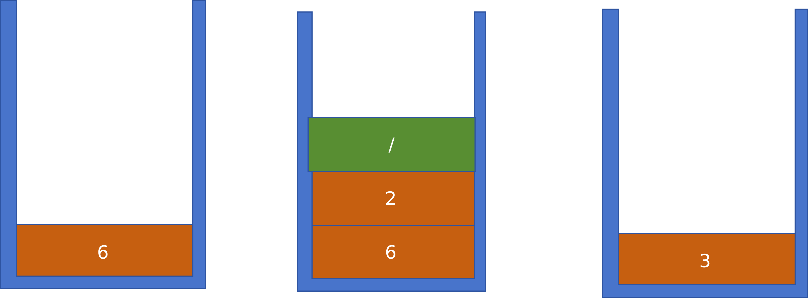
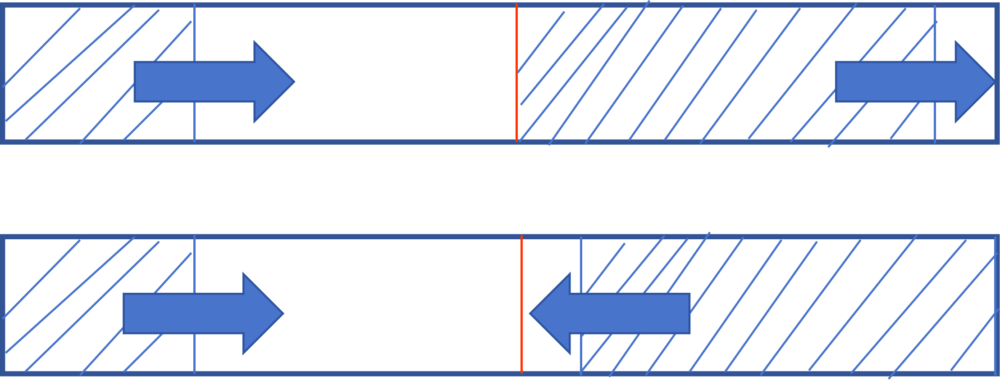

# 堆栈

问题引入：计算机如何进行表达式求值？

例如：`5+6/2-3*4` 
首先，这个表达式有两类对象构成：
- 运算数：5、6、2、3、4
- 运算符号：+、/、-、*

不同运算符号的优先级不同，比如6不是拿来做加法运算的，而是先乘以2，然后再做加法运算。

- **中缀表达式：** 运算符号放在操作数的中间，如5+6/2-3*4
- **后缀表达式：** 运算符号放在操作数的后面，如562/34*-
后缀表达式看起来比较反直觉，但是它更方便进行计算——正常的中缀表达式还要还要等看完后面的运算符号，但是后缀表达式遇到符号就直接取出操作数进行计算，不要自己观察并“加括号“。

比如：`62/3-42*+`
先遇到了6,再遇到2,然后遇到了/，这时候就直接算6/2=3,存好3后遇到3,然后遇到-，这时直接算3-3=0,存下0,后面遇到4,然后是2,再然后是*，这时直接算2*4=8,存下8,然后遇到+，这时直接算8+0=8,存下8,最后得到结果8。

于是我们需要一种存储方法——能顺序存储运算数；并在需要时倒序输出。

于是就有了堆栈

## 什么是堆栈

**堆栈（stack）** 是一种具有一定操作约束的线性表，只能在一端进行插入和删除操作，另一端则是顶端。堆栈的插入操作被称为压栈（push），删除操作被称为弹栈（pop）。

定义太抽象了，用上面的例子来说明一下：



如图，系统不断把新元素放入堆栈，当遇到运算符号时，倒序取出上面两个元素做运算，运算结果再堆上去。

- 插入数据：压栈
- 删除数据：弹栈
- 后入先出：栈顶元素最先被删除(LIFO)

## 堆栈的抽象数据类型描述

-类型名称：Stack
-数据对象集：一个有0个或多个元素的有穷线性表
-操作集： 长度为MaxSize的堆栈$S\in Stack$,堆栈元素$item\in ElementType$

1. Stack CreateStack(int MaxSize):生成空堆栈，最大容量为MaxSize。
2. int IsFull(Stack S,int MaxSize):判断堆栈是否已满。
3. void Push(Stack S,ElementType item):压栈操作，将item压入堆栈S。
4. ElementType Pop(Stack S):弹栈操作，删除并返回堆栈S的栈顶元素。
5. int IsEmpty(Stack S): 判断堆栈是否为空。

## 栈的顺序存储实现

```c
#define MAXSIZE 100

typedef struct SNode* Stack;
struct SNode{
    ElementType data[MAXSIZE];
    int top;
}
```
1.Push
```c
void Push(Stack PtrS,ElementType item){
    if(PtrS->top==MAXSIZE-1){
        fprintf(stderr,"Stack is full\n");
        return;
    }
    PtrS->data[++(PtrS->top)]=item;
    return;
}
```

2.Pop
```c
ElementType Pop(Stack PtrlS){
    if(PtrS->top==-1){
        fprintf(stderr,"Stack is empty");
        return ERROR //ERROR是ElementType的特殊值，标志错误
    }
    return (PtrS->data[(PtrS->top)--]);
}
```

这里不知道大家有没有一个疑惑：没有代码显式地执行了从data数组里删除top指向的元素及其内存的操作，是不是应该在Pop函数里加上这部分代码？
答案是否定的——在栈的实现中，我们通过移动 `top` 来“逻辑删除”元素，而不需要物理清除数据。反正Push是直接覆盖，Pop出的数据留在原内存不会影响栈本身的结构。
```c
// 初始状态
top = -1  // 空栈

// Push 1: top=0, data[0]=1
// Push 2: top=1, data[1]=2  
// Push 3: top=2, data[2]=3

// Pop: 执行 top--, top变成1
// 此时 data[2] 仍然等于3，但 top=1 表示栈顶在 data[1]
// data[2] 的值虽然还在，但对栈操作不可见
```
自己动手多画示意图，这个很有必要！

## 一个数组实现两个堆栈
一个数组可以实现两个堆栈，但必须往中间堆元素，如果同向就会造成一个堆满了另一个还有空位，造成空间的浪费——如图：




就如下面的方式所呈现的，两个栈分别从数组的两头开始往中间Push，当两个栈的栈顶指针相遇时，表示两个栈都满了。
```c
#define MaxSize 100 //此处100只是示例，根据需要存储数据元素的最大个数
struct DStack{
    ElementType data[MaxSize];
    int top_left;
    int top_right;
}S
S.top_left = -1;
S.top_right = MaxSize;
```

```c
void Push(sturct DStack *PtrS,ElementType item,int Tag){
    //Tag作为区分两个栈的标记，0表示左边的栈，1表示右边的栈
    if (PtrS->top_right - PtrS->top_left==1){
        fprintf(stderr,"Stack is full\n");
        return;
    }
    if (Tag){
        PtrS->data[--(PtrS->top_right)]=item;
    }
    else{
        PtrS->data[++(PtrS->top_left)]=item;
    }
}

ElementType Pop(struct DStack *PtrS,int Tag){
    if (Tag){
        if(PtrS->top_right==MaxSize){
            fprintf(stderr,"Stack is empty\n");
            return ERROR;
        }
        return (PtrS->data[(PtrS->top_right)++])
    }
    if(PtrS->top_left==-1){
        fprintf(stderr,"Stack is empty\n");
        return ERROR;
    }
    return (PtrS->data[(PtrS->top_left)--]);
}
```

## 栈的链式存储实现(链表实现堆栈)

栈的链式存储结构实际上就是一个单链表，叫做**链栈**，插入和删除操作只能在链栈的栈顶进行。
显然top不能在链表尾部，因为单向链表只有next来指向下一个节点，你没法靠一个指针返回上一个节点(这句话看不懂的自己去写链表的所有操作集，代码我也写了)。所以top指针必然在链表头部

```c
typedef struct SNode* Stack;
struct SNode{
    ElementType data;
    Stack next;
}
```
初始化一个空栈：
```c
Stack CreateStack(){
    Stack S;
    S = (Stack)malloc(sizeof(struct SNode));
    S->next = NULL;
    return S;
}
```
判断堆栈是否为空：
```c
bool IsEmpty(Stack S){
    return (S->next == NULL);
}
```

压栈操作：
```c
void Push(ElementType item,Stack S){
    Stack temp;
    temp = (Stack)malloc(sizeof(struct SNode));
    temp->data = item;
    temp->next = S->next;
    S->next = temp;
}
```

弹栈操作：
```c
ElementType Pop(Stack S){
    if(IsEmpty(S)){
        fprintf(stderr,"Stack is empty\n");
        return ERROR;
    }
    Stack first_cell = S->next;
    S->next = first_cell->next;
    ElementType top_item = first_cell->data;
    free(first_cell);
    return top_item;
}
```
## 栈的应用:表达式求值

从左到右读取后缀表达式的各项：
1. 运算数直接入栈
2. 运算符：从栈顶弹出两个操作数，进行运算，结果入栈
3. 最后栈顶元素为表达式的结果

其实最大的难点是如何把用户输入的中缀表达式转换为后缀表达式。

比如：`5+6/2-3*4`

第一个数5先输出，然后遇到+号，这个运算符的优先级低所以先记下来，后面输出6,遇到除号了但是不能做计算，因为乘除之上还有指数，阶乘这些上位者，然后输出2,2后面是-，运算优先级低于/，故除号可以输出了。
也就是562/34*-

然后就可以按照上面的算法进行计算了。

有括号的情况看一下视频里的PPT动画，总结起来就是：
准备一个堆栈用来存储运算符号
1. 运算数直接输出
2. 遇到左括号，就入栈
3. 遇到右括号，就弹栈，弹出的元素直接输出，直到遇到左括号为止
4. 运算符：
    - 若优先级大于栈顶运算符，就入栈
    - 若优先级小于或等于栈顶运算符，就弹栈，弹出的元素直接输出，直到栈顶运算符优先级大于或等于当前运算符优先级为止，然后再入栈当前运算符
5. 若各对象处理完毕，则把堆栈中存留的运算符一并输出。

时间复杂度是线性的。

## 栈的其他应用

- 函数调用及递归实现
- 深度优先搜索
- 回溯算法